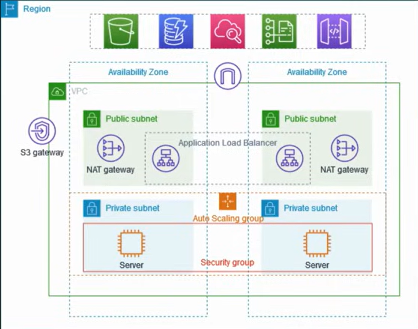
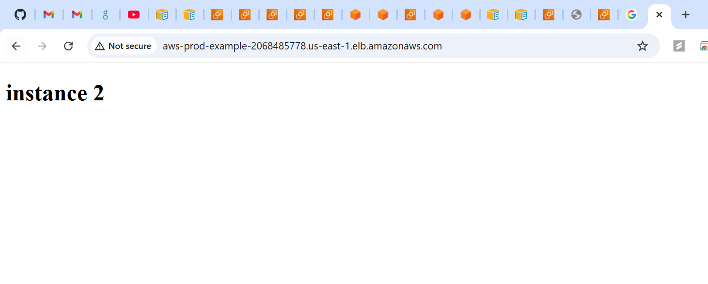

# AWS-

# AWS Production-Grade VPC Architecture Implementation

This repository contains the complete step-by-step implementation for a secure, highly available, and production-ready AWS network architecture. This setup is designed to isolate application servers from the public internet while providing managed access for traffic and maintenance.

## 🏗️ Architecture Overview

The project implements a Multi-AZ (Availability Zone) strategy to ensure fault tolerance and security:
* **VPC:** A custom isolated network (`10.0.0.0/16`).
* **Public Subnets:** Host the Application Load Balancer (ALB), NAT Gateway, and Bastion Host.
* **Private Subnets:** Host the EC2 application instances with no public IP addresses.
* **NAT Gateway:** Allows instances in private subnets to securely access the internet for updates.
* **Auto Scaling Group:** Automatically maintains the desired number of healthy instances.

---

## 🛠️ Step-by-Step Implementation

### 1. Networking Infrastructure
Use the **VPC and more** wizard in the AWS Console for a consistent setup:
1.  **Name Tag:** `AWS-Prod-Project`
2.  **IPv4 CIDR:** `10.0.0.0/16`
3.  **Availability Zones:** Select 2 (e.g., `us-east-1a` and `us-east-1b`).
4.  **Public Subnets:** 2
5.  **Private Subnets:** 2
6.  **NAT Gateway:** 1 per Availability Zone (for full redundancy).
7.  **VPC Endpoints:** None (S3 gateway is optional).

### 2. Launch Template & Auto Scaling
Create a blueprint for your application servers:
1.  **Launch Template:**
    * **AMI:** Ubuntu Server 22.04 LTS.
    * **Instance Type:** `t2.micro` (Free Tier eligible).
    * **Key Pair:** Create or select an existing `.pem` key.
2.  **Security Group (App-SG):**
    * **Inbound Rule:** Allow Port `8000` from the ALB Security Group.
    * **Inbound Rule:** Allow Port `22` (SSH) from the Bastion Host Security Group.
3.  **Auto Scaling Group (ASG):**
    * Attach the Launch Template.
    * Select the **Private Subnets** created in Step 1.
    * Set **Desired Capacity** to 2, **Min** to 2, and **Max** to 4.

### 3. Application Load Balancer (ALB)
Distribute incoming traffic securely:
1.  **Basic Configuration:** Internet-facing ALB.
2.  **Network Mapping:** Select the **Public Subnets**.
3.  **Security Group (ALB-SG):**
    * **Inbound Rule:** Allow Port `80` (HTTP) from `0.0.0.0/0` (Anywhere).
4.  **Target Group:**
    * **Target Type:** Instances.
    * **Protocol/Port:** HTTP on Port `8000`.
    * **Health Check:** Path `/` on Port `8000`.

### 4. Secure Management (Bastion Host)
To access servers in the private subnet:
1.  Launch a `t2.micro` instance in a **Public Subnet**.
2.  **Security Group (Bastion-SG):** Allow Port `22` (SSH) from your IP.
3.  **SSH Tunneling:**
    * Copy your `.pem` key to the Bastion:
        ```bash
        scp -i key.pem key.pem ubuntu@bastion-public-ip:/home/ubuntu/
        ```
    * SSH into the private instance from the Bastion:
        ```bash
        ssh -i key.pem ubuntu@private-ip-of-app-server
        ```

### 5. Application Deployment
Once inside the private instance via the Bastion:
1.  Create a simple web page:
    ```bash
    echo "<h1>Production App: Running in Private Subnet</h1>" > index.html
    ```
2.  Launch a Python-based server:
    ```bash
    python3 -m http.server 8000
    ```

---

## 🏁 Verification
1.  Navigate to the **Load Balancers** section in the AWS Console.
2.  Copy the **DNS Name** of your ALB.
3.  Paste the DNS name into your web browser.
4.  If successful, the browser will display the "Production App" header, confirming that the ALB is correctly routing public traffic to your private-subnet instances.

## 🔄 Traffic Flow & Connectivity

This section explains how data moves through the architecture, ensuring high security by keeping application instances in private subnets.

### 1. Inbound Traffic (Internet to App)
How users access the application without ever reaching the private instances directly:
1. **User Request:** A user hits the **Application Load Balancer (ALB)** DNS name.
2. **Public Entry:** The ALB (located in **Public Subnets**) receives the traffic on Port 80.
3. **Routing:** After validating the Security Group rules, the ALB forwards the request to the **Target Group**.
4. **Private Processing:** The EC2 instances in the **Private Subnets** receive the traffic on Port 8000, process it, and send the response back through the ALB.


### 2. Outbound Traffic (App to Internet)
How private instances securely fetch updates or external data:
1. **Initiation:** A private EC2 instance initiates an outbound request (e.g., `sudo apt update`).
2. **NAT Gateway:** The request is routed to the **NAT Gateway** in the **Public Subnet**.
3. **Internet Bridge:** The NAT Gateway masks the private IP and sends the request to the internet via the **Internet Gateway (IGW)**.
4. **Secure Return:** Data returns to the NAT Gateway, which routes it back to the specific private instance that requested it.

---

## 🖼️ Architecture Snapshots

Below are the visual implementations of the infrastructure described above:

### Full VPC Design


### Deployment Verification



## 📜 Credits
This implementation is based on the [Day-7 AWS VPC Project](https://www.youtube.com/watch?v=FZPTL_kNvXc) from the **AWS Zero to Hero** series by [Abhishek Veeramalla](https://www.youtube.com/@AbhishekVeeramalla).
